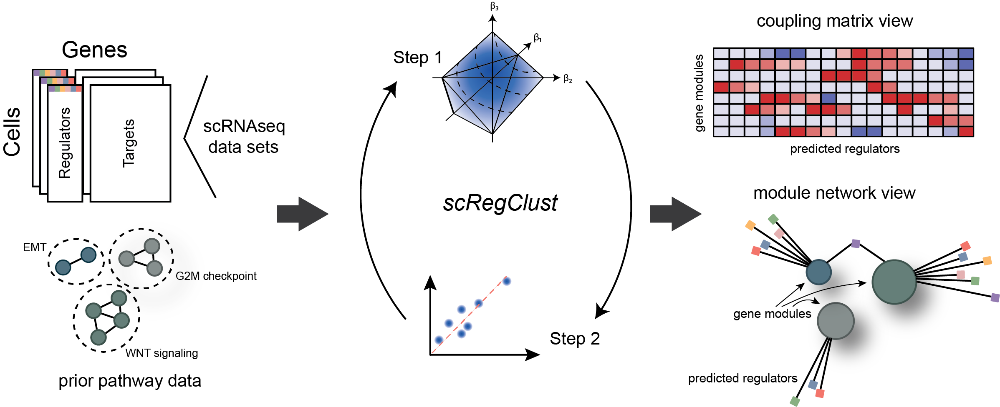

# single-cell Regulatory-driven Clustering (scregclust)

<!-- badges: start -->
<!-- badges: end -->

The goal of scregclust is to cluster genes by regulatory programs. To do
so, clusters are associated with regulatory programs and target genes
are allocated to clusters with best fitting regulatory programs.

## Installation

You can install the development version of scregclust from
[GitHub](https://github.com/) with:

``` r
# install.packages("devtools")
devtools::install_github("sven-nelander/scregclust")
```

## Tutorial

Here we demonstrate the scregclust workflow using the PBMC data from 10X Genomics (available 
[here](https://www.10xgenomics.com/welcome?closeUrl=%2Fresources%2Fdatasets&lastTouchOfferName=PBMC%20from%20a%20Healthy%20Donor%20-%20Granulocytes%20Removed%20Through%20Cell%20Sorting%20%283k%29&lastTouchOfferType=Dataset&product=chromium&redirectUrl=%2Fresources%2Fdatasets%2Fpbmc-from-a-healthy-donor-granulocytes-removed-through-cell-sorting-3-k-1-standard-2-0-0)).

``` r
# Load required packages
library(Seurat)
library(scregclust)

# Import and preprocess data
pbmcData <- Read10X_h5('pbmc_granulocyte_sorted_3k_filtered_feature_bc_matrix.h5', use.names = TRUE, unique.features = TRUE)
pbmcData <- pbmcData$`Gene Expression`

pbmc <- CreateSeuratObject(counts=pbmcData,min.cells = 3,min.features = 200)

pbmc[["percent.mt"]] <- PercentageFeatureSet(pbmc, pattern = "^MT.")
pbmc <- subset(pbmc, subset = percent.mt < 30)
pbmc <- subset(pbmc, subset = nFeature_RNA < 6000)

pbmc <- SCTransform(pbmc,variable.features.n = 6000)

# Extract and format the data according to scregclust requirements

z <- GetAssayData(pbmc,slot='scale.data')
out <- scregclust_format(z)

genesymbols <- out[[1]]
sample_assignment <- out[[2]]
is_predictor <- out[[3]]

# Run scregclust with initial cluster no set to 10 and testing several penalties

fit <- scregclust(
  z, genesymbols, is_predictor,
  target_cluster_start = 10L, penalization = seq(0.1,0.5,0.1),
  n_cycles = 10L, noise_threshold = 0.05, center=FALSE,
  sample_assignment = sample_assignment
)
plot_regulator_network(fit)

# Check metrics to decide on optimal penalty

predictive_r2 <- array(0,dim=c(10,5))
for (i in 1:5){
  predictive_r2[,i] <- fit$results[[i]]$output[[1]]$r2_cluster
}
colnames(predictive_r2) <- fit$penalization

regulator_importance <- array(0,dim=c(379,5))
for (i in 1:5){
  regulator_importance[,i] <- rowMeans(fit$results[[i]]$output[[1]]$importance, na.rm = TRUE)
}

colnames(regulator_importance) <- fit$penalization

par(mfrow=c(2,1))
boxplot(predictive_r2)
boxplot(regulator_importance)
```

## Reference 

[Larsson I & Held F, et al. (2023) Reconstructing the regulatory programs underlying the phenotypic plasticity of neural cancers. Preprint available at bioRxiv; 2023.03.10.532041.](https://doi.org/10.1101/2023.03.10.532041)
