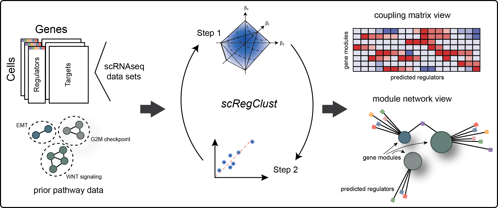

# Single-cell Regulatory-driven Clustering (scregclust)

<!-- badges: start -->

<!-- badges: end -->

## Introduction

The goal of *scregclust* is to cluster genes by regulatory programs. To do so, genes are clustered into modules which in turn are associated with regulators. The algorithm alternates between associating regulators to modules and reallocating target genes into modules.

A detailed description of the algorithm and an in-depth evaluation of its properties can be found in our original research article in Nature Communications, [Larsson, Held, et al. (2024) Reconstructing the regulatory programs underlying the phenotypic plasticity of neural cancers. Nature Communications 15, 9699 DOI 10.1038/s41467-024-53954-3](https://doi.org/10.1038/s41467-024-53954-3)